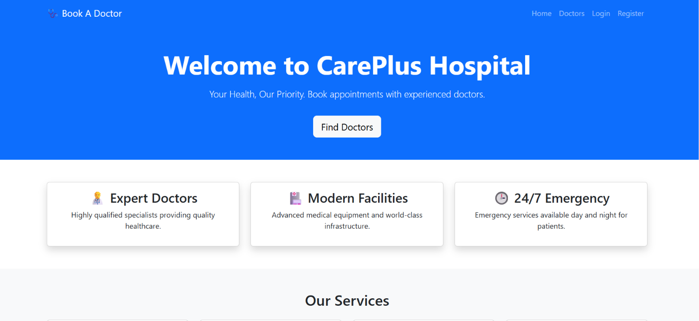
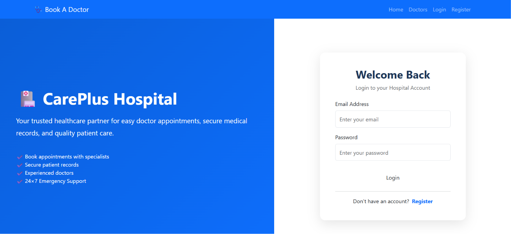
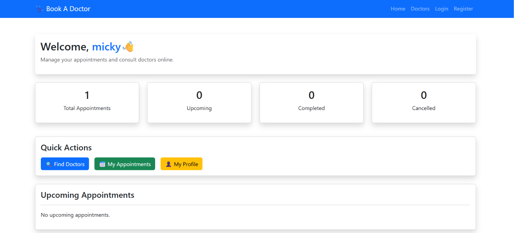
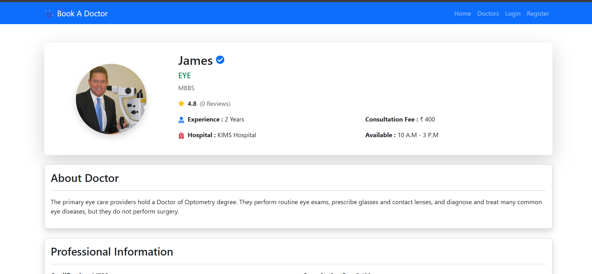
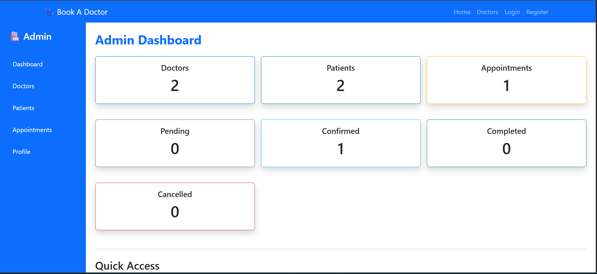
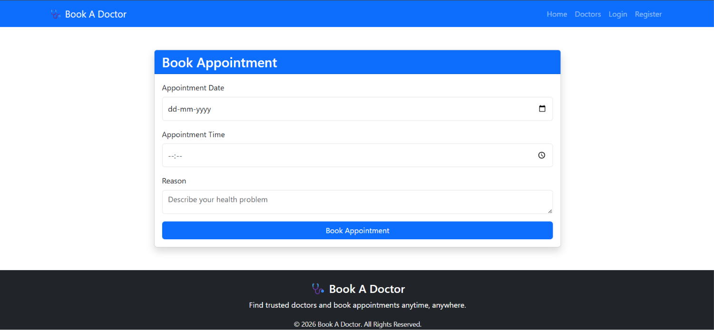

# 🏥 Hospital Management System

A full-stack web application for managing patients, doctors, appointments, and hospital administration.

Built using:
React.js | Node.js | Express.js | MongoDB

## Internship Submission

 - **Intern ID:** CITS1751
 - **Full Name:** KOTA SRAVANTHI
 - **No. of Weeks:** 8 Weeks 
 - **Project Name:** BrainStorm Arena – Multi-Subject Full-Stack Quiz Platform
 - **Domain**: Full Stack Web Development

## 📌 Project Overview

The **Hospital Management System** is a full-stack web application developed to digitize and simplify hospital operations.

The system provides separate platforms for **Patients, Doctors, and Administrators** to manage healthcare activities efficiently.

Patients can search for doctors and book appointments, doctors can manage their appointments, and administrators can monitor and manage the complete hospital system.

This project focuses on improving healthcare accessibility, reducing manual work, and providing an organized digital healthcare management solution.

---

# ✨ Features

## 👤 Patient Module

- Patient registration and login
- Secure authentication
- Search doctors by specialization
- View doctor details
- Book appointments
- View appointment history
- Manage personal profile


## 👨‍⚕️ Doctor Module

- Doctor registration and login
- Create and manage doctor profile
- Add specialization and qualification details
- View booked appointments
- Manage appointment status
- View patient information


## 👨‍💼 Admin Module

- Admin dashboard
- View hospital statistics
- Manage doctors
- Manage patients
- Manage appointments
- Monitor overall system activities

---

# 🎯 Project Objectives

- To develop a digital healthcare management platform
- To simplify doctor appointment booking
- To maintain patient and doctor information securely
- To reduce manual paperwork in hospitals
- To provide role-based access for different users

---

# 🛠️ Technologies Used

## Frontend

- React.js
- JavaScript
- HTML5
- CSS3
- Bootstrap
- Axios
- React Router


## Backend

- Node.js
- Express.js
- REST API


## Database

- MongoDB Atlas
- Mongoose


## Authentication & Security

- JSON Web Token (JWT)
- bcrypt password encryption


## Development Tools

- Visual Studio Code
- Git & GitHub
- Postman
- npm

---

# 🏗️ System Architecture

```
                Users

 Patient      Doctor       Admin
    |            |           |
    --------------------------
               |
        React Frontend
               |
          REST API
               |
       Node.js + Express
               |
          MongoDB
```

---

# 📂 Project Structure

```
Hospital-Management-System

│
├── frontend
│   │
│   ├── public
│   │
│   └── src
│       ├── components
│       ├── pages
│       ├── services
│       ├── context
│       └── App.js
│
│
├── backend
│   │
│   ├── config
│   ├── controllers
│   ├── middleware
│   ├── models
│   ├── routes
│   ├── server.js
│   └── package.json
│
│
├── Screenshots
│
└── README.md
```

---

# ⚙️ Installation and Setup

## Prerequisites

Make sure you have installed:

- Node.js
- npm
- MongoDB Atlas Account
- Git


---

# Backend Setup

Navigate to backend folder:

```bash
cd backend
```

Install dependencies:

```bash
npm install
```

Create a `.env` file inside backend:

```
PORT=5000

MONGO_URI=your_mongodb_connection_string

JWT_SECRET=your_secret_key
```

Start backend server:

```bash
npm run dev
```

Backend will run on:

```
http://localhost:5000
```

---

# Frontend Setup

Open another terminal.

Navigate to frontend:

```bash
cd frontend
```

Install dependencies:

```bash
npm install
```

Start React application:

```bash
npm start
```

Frontend will run on:

```
http://localhost:3000
```

---

# 🔐 User Roles

The system supports three types of users:

| Role | Access |
|------|--------|
| Patient | Book appointments and manage profile |
| Doctor | Manage profile and appointments |
| Admin | Manage complete hospital system |

---

# 🗄️ Database Collections

## Users Collection

Stores user authentication details.

Fields:

```
name
email
password
phone
role
```

---

## Doctors Collection

Stores doctor information.

Fields:

```
user
specialization
qualification
experience
hospital
consultationFee
timings
about
verified
```

---

## Appointments Collection

Stores appointment details.

Fields:

```
patient
doctor
appointmentDate
appointmentTime
reason
status
```

---


# 📸 Screenshots

| Home Page | Login Page |
|-----------|------------|
|  |  |


| Patient Dashboard | Doctor Dashboard |
|------------------|------------------|
|  |  |


| Admin Dashboard | Appointment Management |
|----------------|-----------------------|
|  |  |


---

# 🚀 Future Enhancements

Future improvements that can be added:

- Online payment integration
- Video consultation
- Medicine prescription management
- Medical report upload
- Email and SMS notifications
- AI-based healthcare assistant
- Hospital staff management


---

# ✅ Advantages

- Easy appointment scheduling
- Secure user authentication
- Role-based access control
- Centralized hospital management
- Reduced paperwork
- Improved healthcare communication


---

# 👩‍💻 Developer

**Kota Sravanthi**

Computer Science Engineering Student


---

# 📄 Project Type

Full Stack Web Application

Developed for internship and educational purposes.


---

# ⭐ Acknowledgement

Thanks to the learning resources and technologies that helped in developing this project.